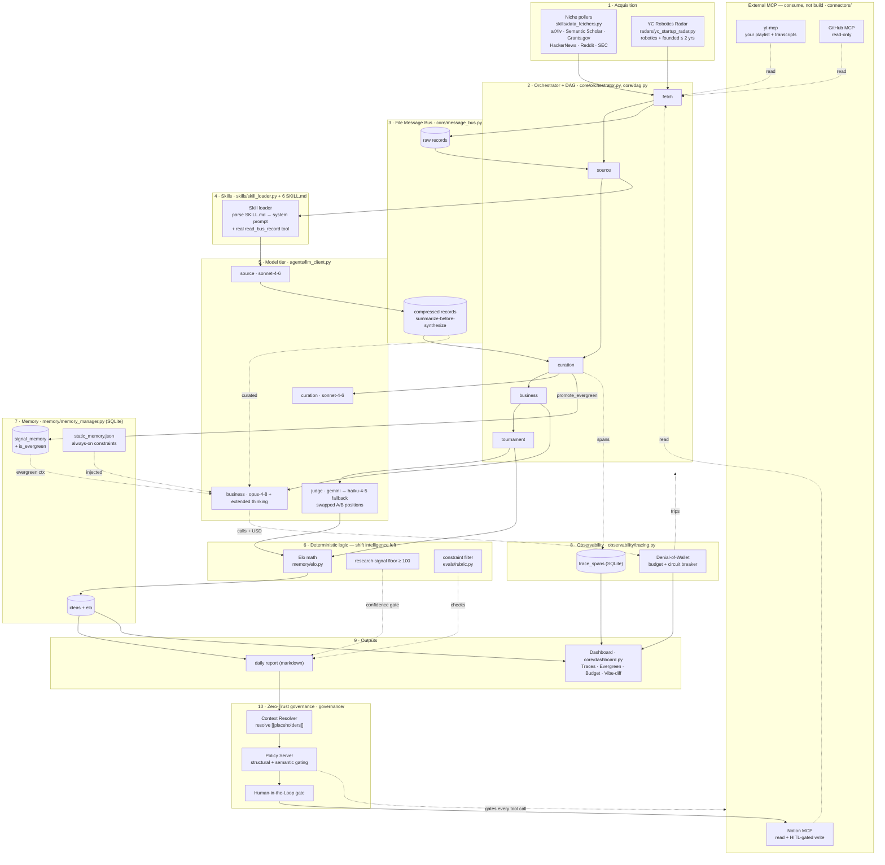

# ARCHITECTURE.md — How the system fits together

`Agent = Model + Harness`. Two views below: a **component & data-flow** diagram (what the
pieces are and how data moves), and a **runtime sequence** diagram (what happens during one
daily cycle). Both render on GitHub, GitLab, Notion, VS Code, and mermaid.live.

---

## 1. Component & data-flow



**Reading it:** acquisition (1) feeds the DAG (2). Each node writes/reads the file bus (3),
which holds *raw* records on ingest and *compressed* records after the skill layer (4) runs
the model (5) for real. Subjective work (which idea wins, what's actionable) is the model's;
arithmetic and hard rules (6) stay in testable code. State lives in SQLite memory (7), every
step emits a span and is bounded by the budget breaker (8), and outputs (9) include the
HITL-gated Notion write and the dashboard.

---

## 2. Runtime sequence — one daily cycle

```mermaid
sequenceDiagram
    autonumber
    participant O as Orchestrator / DAG
    participant T as Tracer + Budget
    participant F as Fetchers / Radars / MCP reads
    participant B as Message Bus
    participant SK as Skill Loader
    participant M as Model tier
    participant ME as Memory (SQLite)
    participant G as Governance (policy + context)
    participant N as Notion (HITL)

    O->>T: open cycle span + budget
    O->>F: fetch (niche pollers + YC + your YouTube/Notion)
    F-->>B: write_raw(signal) → uri

    loop each new, unseen signal
        O->>SK: load SKILL.md for the signal's category
        SK->>M: system = base + skill body; tool = read_bus_record
        M->>B: read_bus_record(uri)
        M-->>O: compressed record (JSON)
        O->>B: write_compressed(record)
        O->>ME: mark_url_processed
    end

    O->>M: curation(compressed records)
    M-->>O: curated + evergreen flags
    O->>ME: promote_evergreen(url)
    Note right of ME: evergreen promotion (the previously-missing step)

    O->>M: business(static + evergreen + curated)  [opus + thinking]
    M-->>O: candidate opportunities

    loop each pair A,B
        O->>M: judge_match(A,B) twice with swapped positions
        M-->>O: winner (Gemini, else Claude fallback)
        O->>O: deterministic Elo update (memory/elo.py)
    end
    O->>ME: save ideas + elo

    O->>O: enforce research-signal floor (≥100)
    O->>G: sanitize args (resolve [[placeholders]])
    G->>G: Policy Server — structural + semantic gating
    alt policy + HITL approve
        G->>N: write_report(parent, markdown)
        N-->>O: page created
    else denied or unconfirmed
        G-->>O: Policy Violation / not approved → skip write
    end
    O->>T: budget snapshot + close spans

    Note over T: if calls/USD exceed budget → CircuitBreakerTripped<br/>→ freeze cycle, preserve state for forensics
```

---

## 3. Key design choices encoded above

- **The skill layer is real, not cosmetic.** The loader injects the `SKILL.md` body into the
  system prompt *and* hands the model a `read_bus_record` tool, then runs a bounded tool loop.
- **Summarize-before-synthesize.** Raw 50k-token transcripts are written once to the bus and
  distilled to ~80-token records; only records flow downstream. (We do not claim "memory
  flushing" — each model call is already stateless.)
- **Judgment is split correctly.** The model decides winners and what's actionable; Elo
  arithmetic, the signal floor, dedup, and constraint checks are deterministic code.
- **Two safety gates.** The HITL gate guards every external write; the Denial-of-Wallet
  breaker bounds every loop and freezes the cycle for forensics if exceeded.
- **Everything is observable.** Each node/model/tool is a span in `trace_spans`, surfaced in
  the dashboard's Agent Traces tab.
